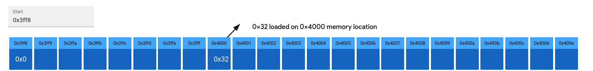
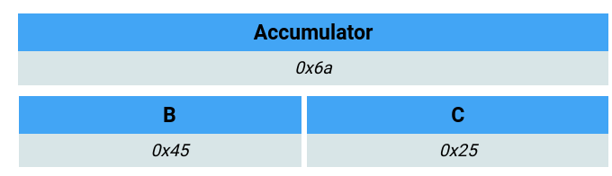
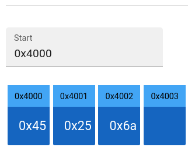
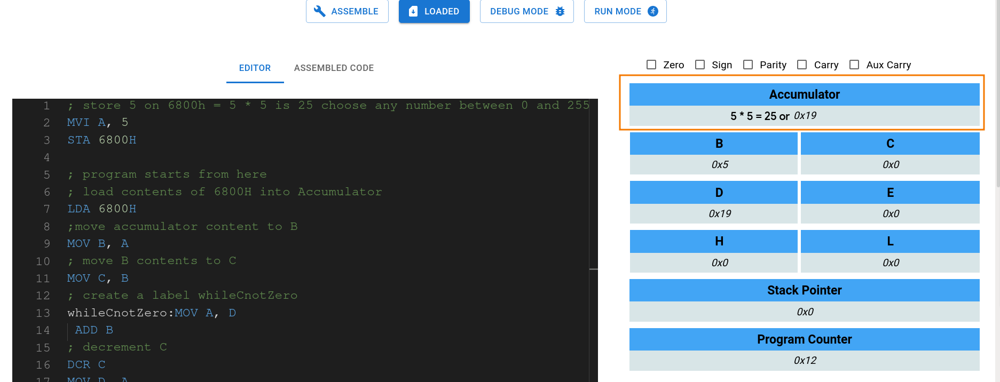
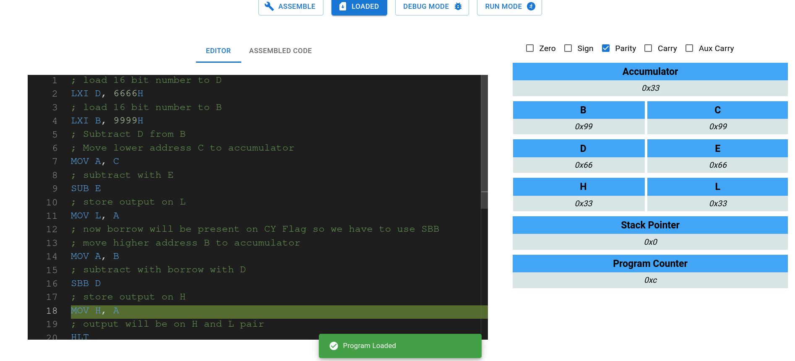
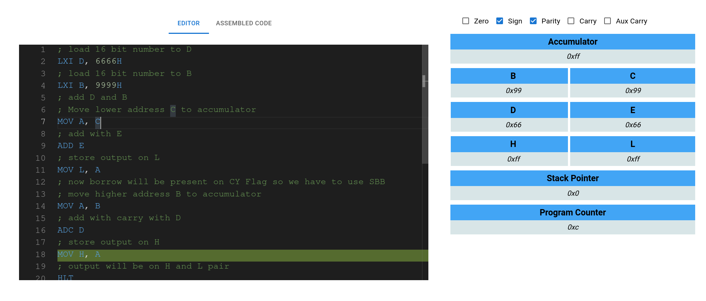

Questions Solved:

1. Store the data byte 32H into memory location 4000H.
```
; move immediate 32h into A
MVI A, 32H
; store accumulator content to 4000h location
STA 4000H
```



2. Write a program to shift an eight bit data four bits right. Assume data is in register C.

```
; load data into C first
MVI C, 0b01011111
; move data to accumulator for shifting
MOV A, C
; 10111110 or BE
RAR 
; 01111100 or 7c
RAR
; 11111000 or f8
RAR
; 11110000 or f0
RAR
HLT
```

3. Add the contents of memory locations 4000H and 4001H and place the result in memory
location 4002H. Also write program description.
```
; initial preperation
MVI A, 45H
STA 4000H
MVI A, 25H
STA 4001H 

; program starts from here 
; load 4000H on HL pair
LXI H, 4000H
; move contents present in address defined by HL i.e 4000h to B
MOV B, M
; Make 4000H into 4001H
INR L
; move contents on 4000h into C
MOV C, M
; move C to A
MOV A, C
ADD B
; store contents on 4002H
STA 4002H
HLT
```



4. Find the square of the given numbers from memory location 6800H and store the result
from memory location 8000H.

```
; store 5 on 6800h = 5 * 5 is 25 choose any number between 0 and 255
MVI A, 12
STA 6800H

; program starts from here
; load contents of 6800H into Accumulator
LDA 6800H
;move accumulator content to B
MOV B, A
; move B contents to C
MOV C, B
; create a label whileCnotZero
whileCnotZero:MOV A, D
 ADD B 
; decrement C
DCR C
MOV D, A
; if C is 0 zero flag will be set 
MOV A, C
; jump to label whileCnotZero until Zero flag is False
JNZ whileCnotZero
MOV A, D
STA 8000H
HLT
```


5. Search the given byte in the list of 50 numbers stored in the consecutive memory locations
and store the address of memory location in the memory locations 2800H and 2801H. Assume
byte is in the C register and starting address of the list is 2500H. If byte is not found store 00 at
2800H and 2801H.
```

LXI D, 0000H 
; assume number is stored from 0000H to 0032H

MVI C, 02H
; assume number to search is 02H

MVI B, 50
 ;50 memory location so B is our counter

; when B reaches 0 we go to notfound lable at bottom
find: MOV B, A
 ; move contents of counter to A

JZ notfound 
; if counter is 0 then go to notfound

LDAX D 
; load content on address that is hold by D register

CMP C
 ; compare with C

INX D
 ; increment D

DCR B
 ; decrease counter

JNZ find
 ; if Zero flag is not enable then number is notfound so go to top loop

MOV D, H
 ; move D to H

MOV E, L
 ; move E to L

SHLD 2800H
; store contents of H and L on 2800H and 2801H

notfound: nop
```

6. Write an assembly language program to separate even numbers from the given list of 50
numbers and store them in the another list starting from 2200H. Assume starting address of 50
number list is 2100H.

7. Write a program to shift a 16 bit data, 1 bit right. Assume that data is in BC register pair.

8. Write a program to find smallest of two 8-bit numbers.

9. Write a program to subtract two 16 bit numbers with Borrow.

```
; load 16 bit number to D
LXI D, 6666h
; load 16 bit number to B
LXI B, 9999h
; Subtract D from B
; Move lower address C to accumulator
MOV A, C
; subtract with E
SUB E
; store output on L
MOV L, A
; now borrow will be present on CY Flag so we have to use SBB
; move higher address B to accumulator
MOV A, B
; subtract with borrow with D 
SBB D
; store output on H
MOV H, A
; output will be on H and L pair 
HLT
```

Output will be on HL register and in this case `3333h`




10. Write a program to add Two 16 bit numbers with carry

```
; load 16 bit number to D
LXI D, 6666H
; load 16 bit number to B
LXI B, 9999H
; add D and B
; Move lower address C to accumulator
MOV A, C
; add with E
ADD E
; store output on L
MOV L, A
; now borrow will be present on CY Flag so we have to use SBB
; move higher address B to accumulator
MOV A, B
; add with carry with D 
ADC D
; store output on H
MOV H, A
; output will be on H and L pair 
HLT
```

Output will be 0xffff or ffffh


